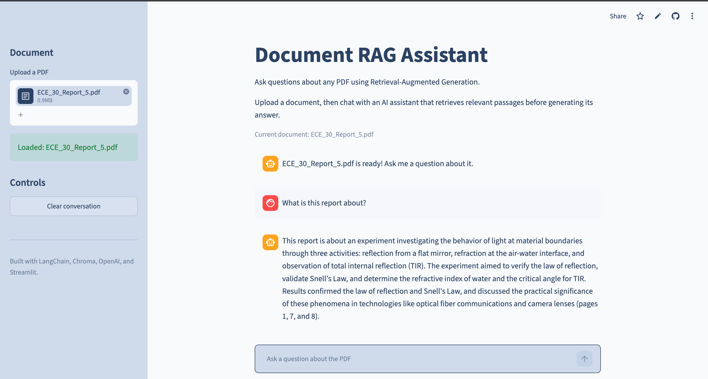
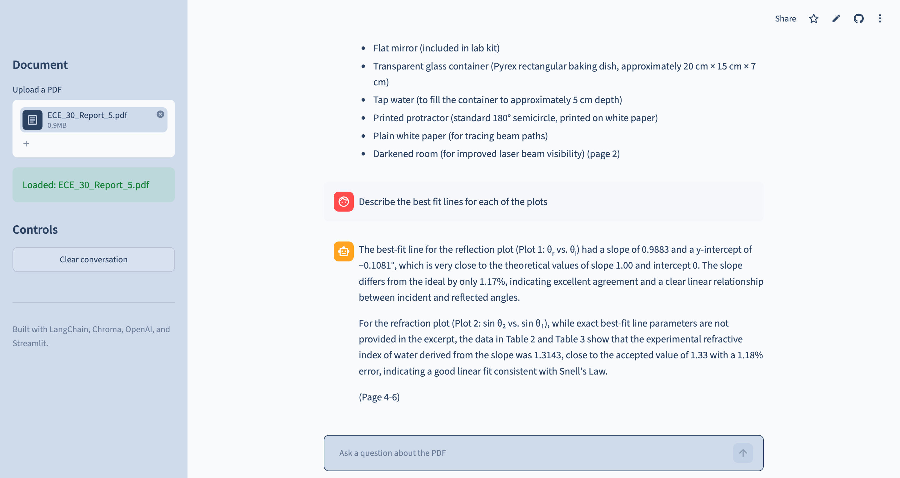

# Document RAG Assistant

An AI-powered document answering question answering application built with Retrieval-Augmented Generation (RAG). Users can upload a PDF, ask questions about its contents, and receive responses based on relevant information retrieved directly from the document. 

The application combines semantic search, vector embeddings, conversational memory, and an LLM to provide context-aware answers while reducing responses based on information outside the uploaded document. 

## Live Demo

Try the application: https://pdf-assistant-ai.streamlit.app/

## Key Features

* PDF Upload: Upload a interact with different PDF documents through a Streamlit interface.
* RAG: Retrieves relevant sections of the documents before generating a response.
* Semantic Search: Uses vector embeddings and Chroma to find document chunks based on meaning rather than exact keyword matches.
* Document Grounding: Instructs the model to answer using information retrieved from the uploaded document and provide page references.
* Conversational Memory: Maintains previous questions and responses during a conversation
* Document Isolation: Uses SHA-256 hashing to identify PDFs and maintain separate vector stores for different documents.
* Vector Store Caching: Reuses previously generated embeddings when the same PDF is uploaded again, reducing processing time and API usage.
* Document Switching: Automatically resets the active retriever and conversation when a different PDF is uploaded.
* Interactive UI: Provides document upload, chat history, loading indicators, and conversation controls through Streamlit.

## Architecture


## Rag Pipeline

1. Document Loading
The uploaded PDF is loaded and its text and page metadata are extracted.

2. Text Chunking
The document is divided into smaller overlapping chunks so relevant sections can be retrieved independently.

3. Embedding Generation
Each chunk is converted into a vector embedding that represents its semantic meaning.

4. Vector Storage
The embeddings and associated document chunks are stored in Chroma for similarity-based retrieval.

5. Semantic Retrieval
When the user asks a question, the question is embedded and compared against the stored vectors to retrieve the most relevant document chunks.

6. Context-Augmented Generation
The retrieved chunks, page information, conversation history, and current question are provided to the LLM as context.

7. Grounded Response
The LLM generates an answer using the retrieved document context and can reference the pages containing the supporting information.

## Document Caching

Each uploaded PDF is identified using a SHA-256 hash of its contents:

PDF → SHA-256 Hash → Unique Chroma Database

If the same PDF is uploaded again, the application detects the matching hash and loads its existing vector store rather than rebuilding all document embeddings.

Different PDFs receive different database paths, preventing embeddings from separate documents from being mixed.

## Tech Stack

| Technology            | Purpose                                                           |
| --------------------- | ----------------------------------------------------------------- |
| **Python**            | Core application and backend logic                                |
| **LangChain**         | RAG pipeline, document processing, retrieval, and LLM integration |
| **OpenAI API**        | Embedding generation and LLM responses                            |
| **Chroma**            | Vector storage and semantic similarity search                     |
| **PyPDF**             | PDF text extraction                                               |
| **Streamlit**         | Interactive web interface and application deployment              |
| **SHA-256 / hashlib** | Content-based document identification and cache management        |

## Project Structure

```text
AI_PDF_Chatbot/
|____assets/
|    |----architecture.png
|    |
|____src/
|    |----app.py
|    |----chatbot.py
|    |
|    |____components/
|    |    |----embeddings.py
|    |    |----loader.py
|    |    |----memory.py
|    |    |----prompt.py
|    |    |----splitter.py
|    |    |----vectorstore.py
|    |    |----config.py
|    |
|    |____utils/
|    |   |----helpers.py
|    |
|    |____streamlit/
|    |   |----config.toml
|    |
|____requirements.txt
|____README.md
|____.gitignore
|____LICENSE
```

The application separates document loading, text splitting, embedding generation, vector storage, conversation memory, and prompting into individual components to keep the RAG pipeline modular and maintainable.

## Running Locally

### 1. Clone the repository

```bash
git clone https://github.com/arpana0505/AI_PDF_Chatbot.git
```

### 2. Create a virtual environment

Python 3.11 is recommended.

```bash
python3.11 -m venv venv
source venv/bin/activate
```

### 3. Install dependencies

```bash
pip install -r requirements.txt
```

### 4. Configure the OpenAI API key

Create a `.env` file in the project root:

```text
OPENAI_API_KEY=your_openai_api_key
```

The `.env` file is excluded from version control through `.gitignore` to prevent API credentials from being committed to the repository.

### 5. Start the application

```bash
python3.11 -m streamlit run src/app.py
```

The Streamlit application will open in your browser.

## Usage

1. Upload a PDF using the sidebar.
2. Wait for the document to be processed and indexed.
3. Ask questions about the document using the chat input.
4. Continue asking follow-up questions using the conversational interface.
5. Use **Clear Conversation** to reset the chat while keeping the current document available.
6. Upload a different PDF to automatically switch the active document and knowledge base.

## Demo




## Future Improvements

* Multi-Document RAG: Allow users to upload and query multiple PDFs within the same knowledge base.
* Improved Document Parsing: Add support for scanned PDFs, tables, and image-heavy documents using OCR and more advanced parsing techniques.
* Enhanced Retrieval: Experiment with reranking and hybrid search to improve retrieval quality for complex or broad questions.
* Source Visualization: Allow users to view the exact document passages used to generate each response.
* Persistent Cloud Storage: Move vector storage from the application's local filesystem to a managed vector database for durable caching across deployments.
* RAG Evaluation: Build an evaluation pipeline to measure retrieval relevance, answer faithfulness, response quality, and latency across a test question set.


